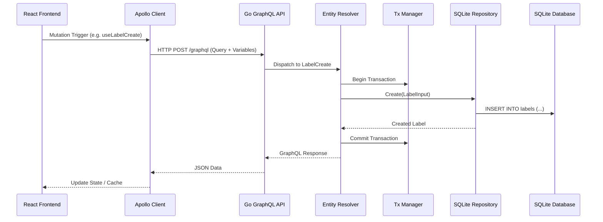
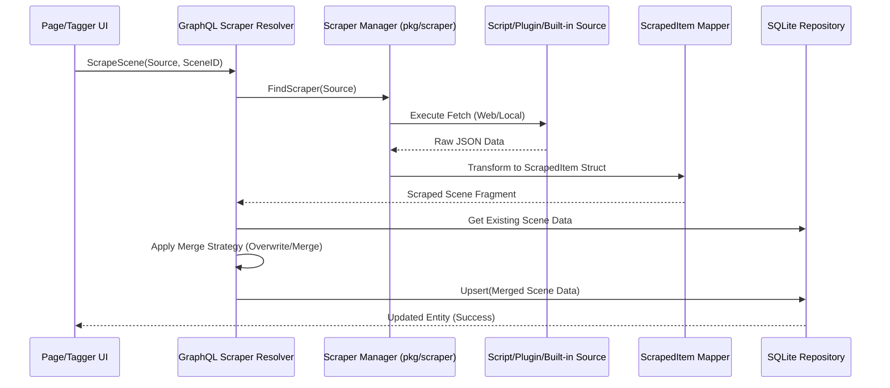
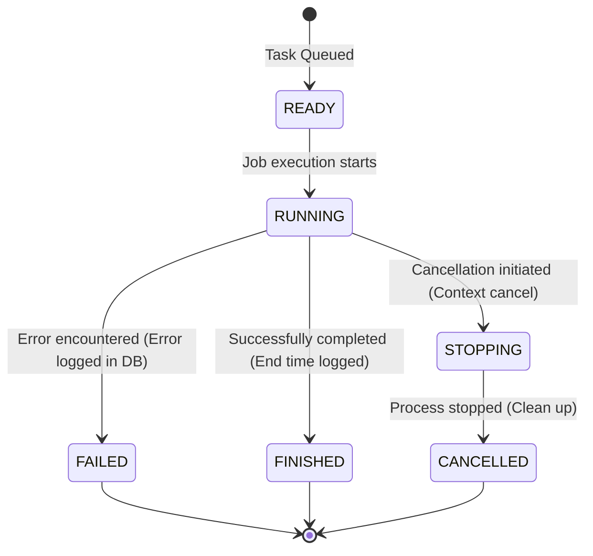
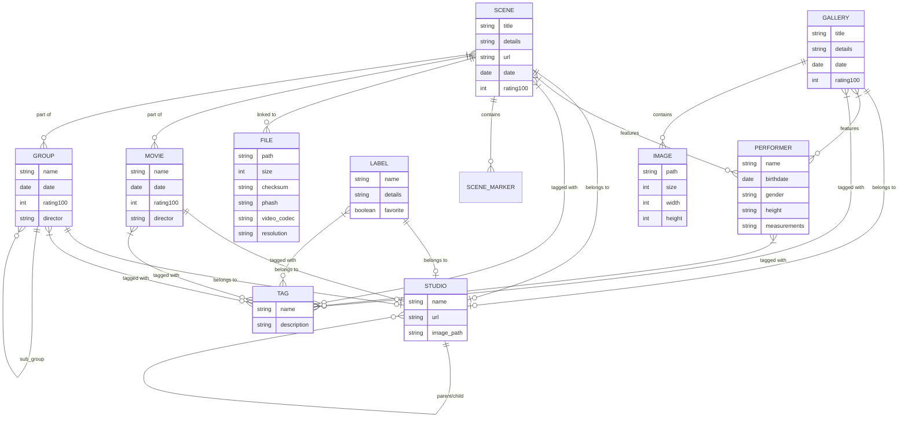

# Stash (stashapp) - Project AI Context

This document provides essential context, architectural patterns, and structural details for AI agents working on the Stash repository. It is designed to help AI understand the "soul" of the codebase and the relationships between data and logic.

## 1. Project Overview & Tech Stack

Stash is a self-hosted media manager designed for organizing local video and image collections. While it has specialized features for adult content (scrapers, performers, studios), the underlying technology is a robust, decoupled client-server application.

- **Backend**: Go (Golang)
- **Database**: SQLite (local portability)
- **API Layer**: GraphQL (using `gqlgen` on the backend)
- **Frontend**: React, TypeScript, Apollo Client, Vite
- **Infrastructure**: Docker support, Cross-platform builds (Go + Node)

---

## Mermaid Diagrams

### Request Flow (UI to Database)


### Deep Library Scan Logic (Flowchart)
```mermaid
flowchart TD
    A[Start Scan] --> B[Walk Directory]
    B --> C{Supported Ext?}
    C -- No --> B
    C -- Yes --> D{File in DB?}
    D -- No --> E[New File: Create Record]
    D -- Yes --> F{Metadata Changed? <br/>Size/ModTime}
    F -- No --> G[Verify Fingerprints]
    F -- Yes --> H[Re-scan Metadata <br/>(pkg/ffmpeg)]
    E --> H
    H --> I[Generate Hashes <br/>(MD5/OSHash/PHash)]
    I --> J{Duplicate PHash Found?}
    J -- Yes --> K[Link to Existing Scene Entity]
    J -- No --> L[Create New Entity Match]
    G --> M[Check Missing Assets <br/>(Thumbs/Previews)]
    M -- Yes --> N[Queue Generation Task]
    K --> O[End Scan]
    L --> O
    N --> O
```

### Scraper Execution Flow (Sequence Diagram)


### Task Management States


### Entity Relationships (Detailed ER Diagram)


---

## 2. Refined Project Structure

### Backend (`pkg/`)
- `pkg/api/`: GraphQL entry points and resolvers.
- `pkg/models/`: Go structs defining the source-of-truth for entities.
- `pkg/sqlite/`: Repository implementations. SQL logic for CRUD operations.
- `pkg/sqlite/migrations/`: Versioned SQL files for schema evolution.
- `pkg/file/`: File system scanning and physical media identification.
- `pkg/ffmpeg/`: FFMPEG wrappers for transcoding and asset generation.
- `pkg/job/`: Orchestration for background tasks (Scanning, Generating, Scraping).
- `pkg/scraper/`: Metadata providers (Built-in, Plugin, and Script-based).

### Frontend (`ui/src/`)
- `ui/src/components/`: Reusable UI components (Atomic design).
- `ui/src/pages/`: Page-level containers and logic.
- `ui/src/hooks/`: Data-fetching hooks (Powered by Apollo/GraphQL).
- `ui/src/models/`: TypeScript types synced with the GraphQL schema.

---

## 3. Creation Flow: UI to Database

Tracing a typical "Insert/Create" action (e.g., creating a **Label**):

1. **User Action**: Form submission in a UI component (e.g., `LabelEdit.tsx`).
2. **Apollo Hook**: Component calls `useLabelCreateMutation`.
3. **GraphQL Request**: Mutation sent to `/graphql` via Apollo Client.
4. **Backend Entry**: `pkg/api/resolver.go` routes to the `LabelCreate` resolver.
5. **Transaction**: The resolver initiates a transaction via `pkg/txn/`.
6. **Repository**: Resolver calls `sqlite.LabelRepository.Create`.
7. **SQL EXEC**: `INSERT INTO labels (...)` is executed in `pkg/sqlite/label.go`.
8. **Completion**: If successful, the transaction commits and the new object returns to the UI.

---

## 4. Main Features & Database Mapping

Logic in Stash is driven by the relationship between physical files and logical entities.

| Feature | Tables | Logic Path |
| :--- | :--- | :--- |
| **Media Indexing** | `files`, `folders` | `pkg/file/scan.go` |
| **Metadata Mgmt** | `scenes`, `galleries`, `images` | `pkg/sqlite/` entity repositories |
| **Taxonomy** | `tags`, `labels` | `pkg/sqlite/tag.go`, `pkg/sqlite/label.go` |
| **Profiles** | `performers`, `studios` | `pkg/performer/`, `pkg/studio/` |
| **Duplicate Detection**| `files` (checksum, phash) | `pkg/phasher/`, `pkg/manager/tasks/generate` |
| **Multi-File Logic** | `files` <-> `scenes` (M:M) | `pkg/models/model_joins.go` |
| **Async Updates** | `jobs` | `pkg/job/`, WebSockets via `/graphql` |

---

## 5. Detailed Database Schema

### Core Tables
- **`scenes`**: Primary video entities. (Title, Date, Rating, StudioID).
- **`performers`**: Actors/Actresses. (Name, Birthdate, Gender, Ethnicity, Measurements).
- **`files`**: Physical storage metadata. (Path, Size, Duration, Resolution, Codecs). **Decoupled from Scenes.**
- **`images`**: Individual images (often linked to Galleries).
- **`labels`**: Categorization for Studios/Performers. (Name, ImageBlob).
- **Join Tables**: `scene_performers`, `scene_tags`, `performer_tags`, `gallery_tags`.

### Storage & Performance
- **Database**: `stash.sqlite` (usually in the user's config directory).
- **Migrations**: Versioned SQL scripts in `pkg/sqlite/migrations/`.
- **Indexing**: Extensive use of indexes on Title, Rating, Date, and Checksums for fast filtering.

---

## 6. Core Entities & Relationships

- **Scene**: Belongs to a **Studio**, has many **Performers** and **Tags**. Linked to one or more **Files**.
- **Performer**: Central profile that appears across many **Scenes** and **Galleries**.
- **Gallery**: A collection of **Images**. Can be associated with **Studios**, **Performers**, and **Tags**.
- **Tag**: A global classification that can be attached to any major entity.
- **Studio**: Used to group **Scenes** and **Galleries**; can have parent/child relationships.

---

## 7. Coding Patterns

- **GraphQL Codegen**: Always run `make generate` to sync changes between `.graphql` schemas and Go/TypeScript code.
- **QueryBuilder**: Specialized Go logic in `pkg/sqlite/query.go` for dynamically building complex SQL filters.
- **Transaction Safety**: All database modifications should be wrapped in `WithTx` blocks via the `txn` package.
- **Decoupled Assets**: Physical file manipulation (moving, deleting) is separate from entity updates (changing a scene's title).

---

## 8. Development Workflow

- **Backend**: `make server-start` (runs on :9999).
- **Frontend**: `make ui-start` (runs on :3000).
- **Sync**: `make generate` (crucial after any GraphQL schema change).
- **Lint**: `make lint` (backend), `make validate-ui` (frontend).
